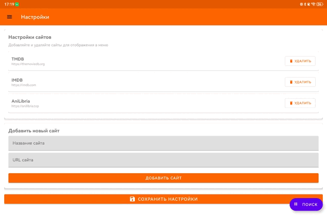

# MovieTorr Android

Android приложение для поиска бесплатных видео с интеграцией популярных видеопорталов. Добавляет функциональность поиска видео прямо на страницы с настраиваемым меню сайтов.

## 🎬 Функции

- **WebView интеграция** с сайтами
- **Плавающая кнопка поиска** видео на всех страницах
- **Поиск бесплатных видео** через различные источники
- **Автоматический поиск** при открытии диалога
- **Магнитные ссылки** и хеш-суммы для загрузки
- **Сохранение последнего источника** (Freepik и другие)
- **Адаптивный интерфейс** для мобильных устройств
- **История поиска** видео
- **Настраиваемое меню** - добавление и удаление сайтов в левом меню
- **Сохранение последнего источника** - приложение запоминает последний выбранный сайт
- **Интуитивная навигация** - клик по карточке для скачивания, клик по источнику для просмотра деталей
- **Магнитные ссылки** - для скачивания через торрент-клиенты (например, LibreTorrent)

## 🎥 Демонстрация работы



*Принцип работы приложения: плавающая кнопка поиска на любой странице, автоматическое извлечение названий из title страницы, компактный интерфейс поиска с магнитными ссылками*

## 🔗 Используемые API и проекты

### LibreKinopoisk
MovieTorr основан на расширении [LibreKinopoisk](https://github.com/Lifailon/LibreKinopoisk) - расширении для Google Chrome, Mozilla Firefox и Android, которое добавляет кнопки на сайт Кинопоиск и реализует интерфейс TorAPI для быстрого поиска медиа в открытых источниках.

- 🌐 [Chrome Web Store](https://chrome.google.com/webstore/detail/librekinopoisk)
- 🔥 [Firefox Add-ons](https://addons.mozilla.org/ru/firefox/addon/librekinopoisk)
- 📱 [GitHub репозиторий](https://github.com/Lifailon/LibreKinopoisk)

### TorAPI
MovieTorr использует [TorAPI](https://github.com/Lifailon/TorAPI) - неофициальный API для получения торрент-файлов и детальной информации о раздачах с трекеров RuTracker, Kinozal, RuTor и NoNameClub.

**Благодарим [Lifailon](https://github.com/Lifailon) за создание и поддержку LibreKinopoisk и TorAPI!** 🎉

- 📚 [Документация TorAPI](https://app.swaggerhub.com/apis-docs/Lifailon/TorAPI)
- 🐳 [Docker образ](https://hub.docker.com/r/lifailon/torapi)
- 📦 [NPM пакет](https://www.npmjs.com/package/torapi)

## 🛠️ Технологии

- **Kotlin** 2.1.0 - основной язык разработки
- **Android Gradle Plugin** 8.7.3 - сборка проекта
- **Gradle** 8.14.3 - система сборки
- **Material Components** 1.14.0 (M3 Expressive) - современный UI
- **AndroidX** (последние версии) - совместимость и функциональность
- **WebView** - для отображения веб-сайтов
- **JavaScript Interface** - для взаимодействия между WebView и нативным кодом
- **TorAPI** - для поиска видео в различных источниках
- **OkHttp** 4.12.0 - для HTTP запросов к TorAPI
- **Gson** 2.13.1 - для парсинга JSON ответов
- **JUnit 5** 5.13.0 - тестирование

## 📱 Требования

### Системные требования
- **Android API 24** (Android 7.0) или выше
- **Target SDK 35** (Android 15)
- **JDK 21** для разработки
- **Android Studio** Ladybug | 2024.2.1 или новее

### Для скачивания видео
- **Торрент-клиент** - для обработки магнитных ссылок
  - **LibreTorrent** - рекомендуемый открытый торрент-клиент
  - **uTorrent** - популярный торрент-клиент
  - **qBittorrent** - кроссплатформенный торрент-клиент

## 📁 Структура проекта

```
app/
├── src/main/java/com/librekinopoisk/android/
│   ├── MainActivity.kt                 # Основная Activity с WebView
│   ├── TorApiService.kt               # HTTP клиент для TorAPI
│   ├── TorrentSearchDialog.kt         # Диалог поиска видео
│   ├── SearchHistoryFragment.kt       # Фрагмент истории поиска
│   ├── SearchHistoryManager.kt        # Менеджер истории поиска
│   ├── SettingsFragment.kt            # Фрагмент настроек
│   └── SiteSettingsManager.kt         # Менеджер настроек сайтов
├── src/main/res/
│   ├── layout/                        # XML layouts
│   ├── values/                        # Строки, цвета, стили
│   ├── drawable/                      # Иконки и изображения
│   └── menu/                          # Меню навигации
└── build.gradle                       # Конфигурация модуля
```

## 🚀 CI/CD

### 🔄 Автоматическая сборка

Проект настроен с GitHub Actions для автоматической сборки:

- **При создании тега v***: создается версионированный релиз
- **APK подписывается** с использованием GitHub Secrets
- **JDK 21** для всех задач сборки
- **Автоматическое тестирование** и проверка зависимостей

### 📊 Workflow статусы


### 🛠️ Локальная сборка

1. Открыть проект в Android Studio
2. Синхронизировать Gradle файлы  
3. Собрать приложение через Build > Build Bundle(s) / APK(s)

**Или через командную строку:**
```bash
# Debug сборка
./gradlew assembleDebug

# Release сборка
./gradlew assembleRelease
```

## ⚖️ Правовая информация

### ⚠️ Важное уведомление

**MovieTorr - ДЕМОНСТРАЦИОННОЕ ПРИЛОЖЕНИЕ**

Данное приложение создано исключительно в демонстрационных и образовательных целях для показа возможностей интеграции веб-сервисов и API. Приложение НЕ предназначено для коммерческого использования или нарушения авторских прав.

### 📋 Ограничения использования

- Приложение предназначено только для поиска легального контента
- Запрещено использование для загрузки материалов, защищенных авторским правом
- Пользователи несут полную ответственность за соблюдение законодательства
- Разработчик не несет ответственности за действия пользователей

### ⚖️ Правовая ответственность

- Пользователи самостоятельно определяют легальность загружаемого контента
- Загрузка защищенного авторским правом контента является нарушением закона
- Разработчик не контролирует и не одобряет незаконную деятельность
- Вся ответственность за использование приложения лежит на пользователе

### 🛡️ Отказ от ответственности

Приложение предоставляется "как есть" без каких-либо гарантий. Разработчик не несет ответственности за любой ущерб, возникший в результате использования приложения.

### 📜 Соответствие законодательству

Пользователи обязаны соблюдать все применимые законы об авторском праве и интеллектуальной собственности в своей юрисдикции.

**Используя данное приложение, вы подтверждаете, что понимаете и принимаете все вышеуказанные условия.**

## 📄 Лицензия

Этот проект лицензирован под MIT License - см. файл [LICENSE](LICENSE) для деталей.